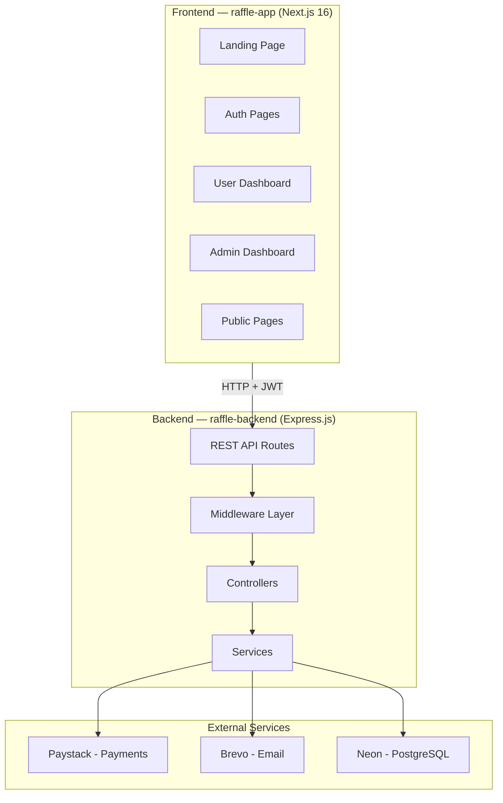
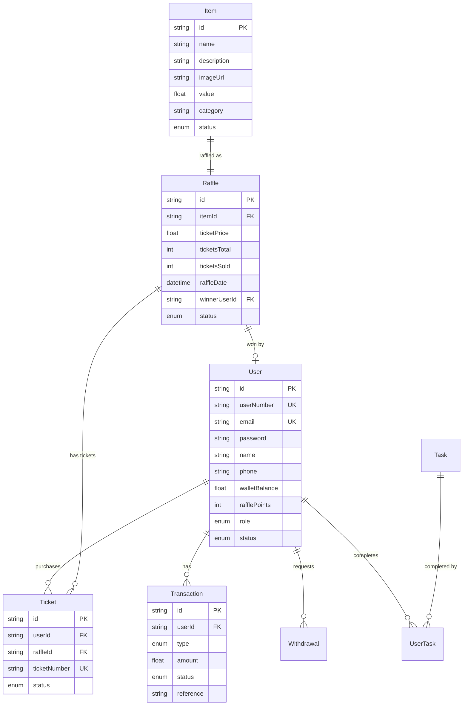
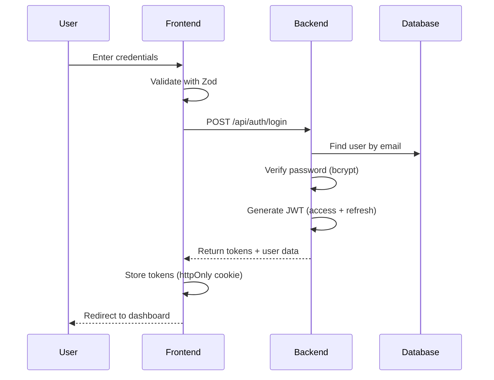
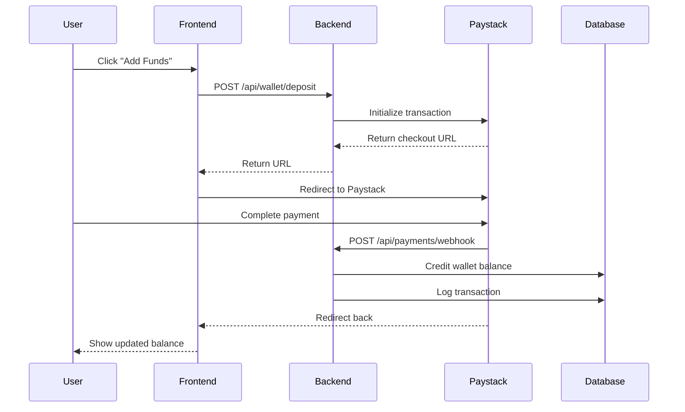
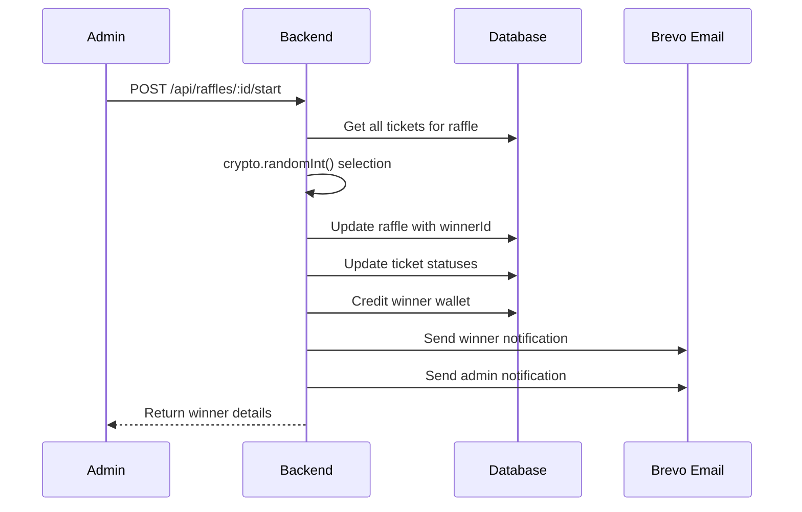
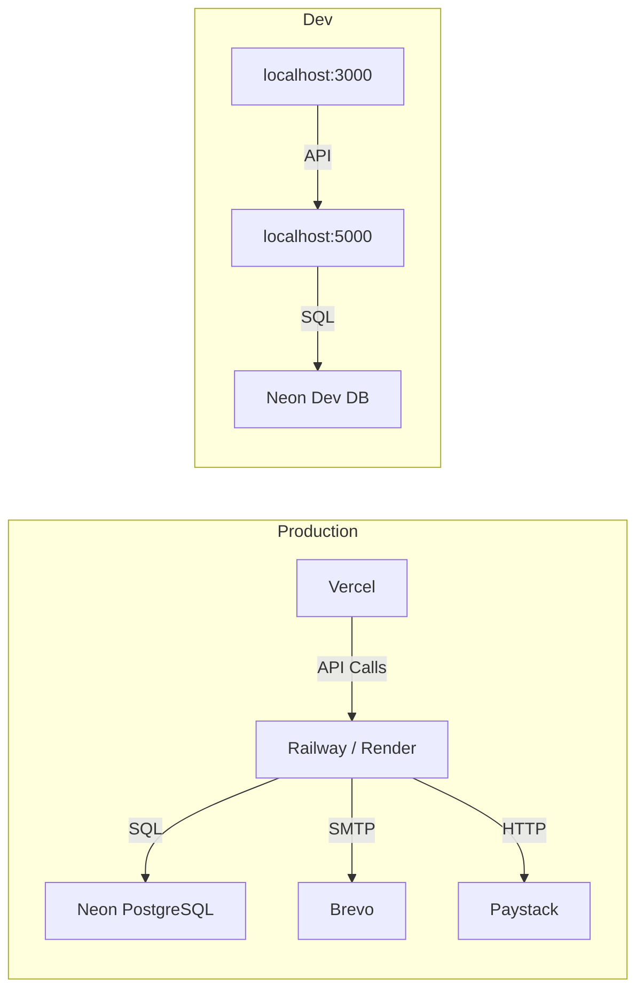

# RaffleHub — Architecture & Technical Reference

> **Reference:** [myraffle.md](file:///c:/Users/Administrator/Documents/ROWLAND/raffle-project/doc/myraffle.md)  
> **Last Updated:** February 10, 2026

---

## System Architecture

---

## Technology Stack

| Layer | Technology | Purpose |
|-------|-----------|---------|
| **Frontend** | Next.js 16 (App Router) | SSR, routing, React framework |
| **Language** | TypeScript | Type safety across entire stack |
| **Styling** | Tailwind CSS v4 | Utility-first CSS |
| **State** | Zustand | Lightweight client-side state |
| **Forms** | React Hook Form + Zod | Form handling + validation |
| **Icons** | Lucide React | Consistent icon library |
| **Backend** | Express.js | REST API server |
| **ORM** | Prisma | Type-safe database access |
| **Database** | PostgreSQL (Neon) | Serverless relational database |
| **Auth** | JWT (HS256) | Stateless authentication |
| **Payments** | Paystack | Nigerian payment processing |
| **Email** | Brevo | Transactional emails |
| **Pkg Manager** | Bun (frontend), pnpm (backend) | Dependency management |

---

## Database Entity Relationships

---

## API Architecture

### Authentication Flow

### Payment Flow

### Raffle Flow

---

## Security Considerations

| Area | Implementation |
|------|---------------|
| **Passwords** | bcrypt with salt rounds (10+) |
| **Tokens** | JWT HS256, 24h access / 7d refresh |
| **Input** | Zod validation on frontend + backend |
| **CORS** | Whitelist frontend domain only |
| **Payments** | Paystack webhook signature verification |
| **Admin** | Role-based middleware guard |
| **SQL** | Prisma ORM (parameterized queries) |
| **Secrets** | Environment variables, never committed |

---

## Deployment Architecture

| Service | Provider | Tier |
|---------|----------|------|
| Frontend | Vercel | Free / Pro |
| Backend | Railway or Render | Starter |
| Database | Neon | Free (0.5GB) / Pro |
| Email | Brevo | Free (300/day) |
| Payments | Paystack | Standard |
